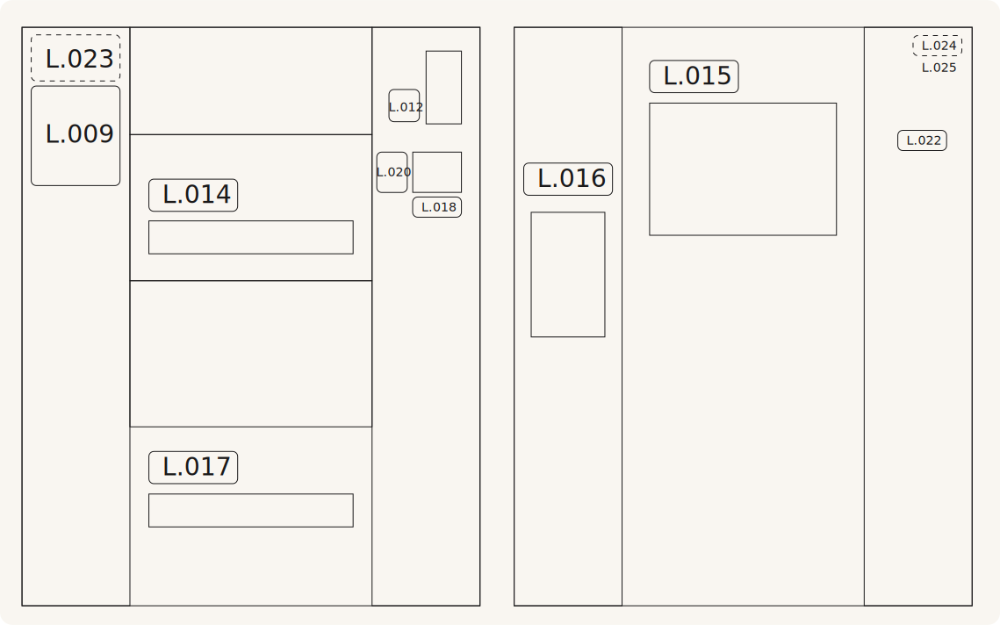

# K.TD
## TD kurutma makineleri için etiket kiti

### Kullanım

* TTD20
* TTD40
* TTD60
* TTD110
* JTD20
* JTD40
* JTD60
* JTD110
* WTD20
* WTD40
* WTD60
* WTD110

### İçerik

* [L.009](../label/L.0.md)
* [L.012](../label/L.0.md)
* [L.012](../label/L.0.md)
* [L.014](../label/L.0.md)
* [L.015](../label/L.0.md)
* [L.016](../label/L.0.md)
* [L.017](../label/L.0.md)
* [L.018](../label/L.0.md)
* [L.020](../label/L.0.md)

### Malzeme ve baskı

Kendinden yapışkanlı mat şeffaf folyo, opak mürekkeplerle beyaz + CMYK baskı.

### İlgili kitler

* [K.TD-G](K.TD-G.md) Gazlı kurutucular için ek kit
* [K.WTD](K.WTD.md) Washex kurutucular için kit
* [K.WTD-G](K.WTD-G.md) Washex gazlı kurutucular için ek kit
* [K.TD20](K.TD20.md) TD20 kurutucular için ek kit

### Yerleşim şeması

