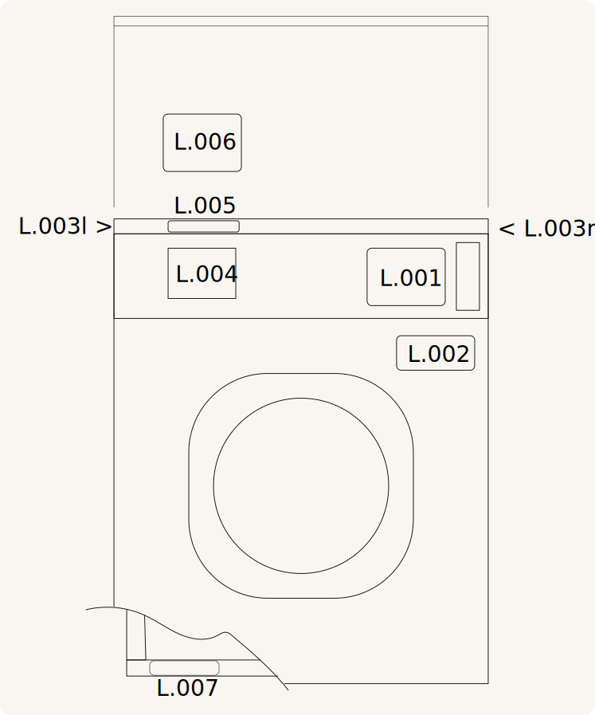

# K.WE-M
## WE20 ve WE40 yıkayıcılar için etiket kiti

### Kullanım

* TWE20
* TWE40
* JWE20
* JWE40
* WWE20
* WWE40

### İçerik

* [L.001](../label/L.001.md)
* [L.002](../label/L.002.md)
* [L.003](../label/L.003.md)
* [L.004](../label/L.004.md)
* [L.005](../label/L.005.md)
* [L.006](../label/L.006.md)
* [L.007](../label/L.007.md)

### Malzeme ve baskı

Kendinden yapışkanlı mat şeffaf folyo, opak mürekkeplerle beyaz + CMYK baskı.

### Yerleşim şeması

